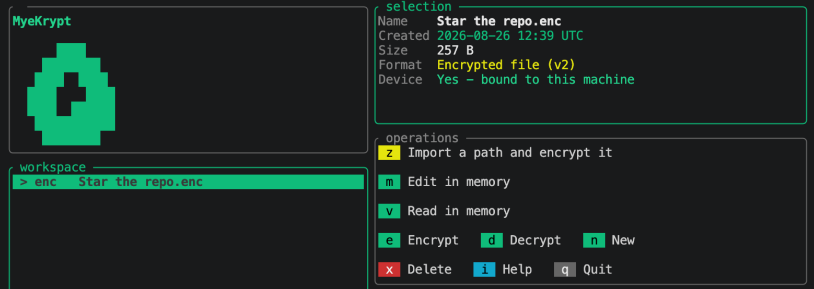

> 🌐 Read this in other languages: [English](README.md) | [Русский (Original)](README.ru.md)
# MyeKrypt (cmf)

Шифратор для файлов, документов и медиа.

Я сделал MyeKrypt потому что негде было держать пароли и фразы от кошельков(Именно под рукой)

## Билд

```bash
cargo build --release
cargo install --path . --locked #опционально
./target/release/cmf 
#или 
cmf
```

## Использование
`cmf` без аргументов открывает каталог с файлами по умолчанию это `./source` НО вы можете сделать свой `$MYEKRYPT_HOME`.

```bash
cmf notes.txt
cmf -d -o ~/restored notes.txt.enc
cmf -H -s ~/Documents/taxes
```

`-d` расшифровывает, `-o` задаёт каталог для результата, `-s` удаляет оригинал
после шифрования, `-H` привязывает контейнер к устройству. Всё что не указано
флагом, СПРОСИТ С ВАС ЛИЧНО

## Клавиши

| Клавиша | что делает|
| --- | --- |
| `z` | импортировать путь и зашифровать |
| `n` | новый зашифрованный файл |
| `v` / `m` | просмотр / правка в памяти |
| `e` / `d` | зашифровать / расшифровать выбранное |
| `x` | удалить при желании с затиранием |
| `r` | обновить список |
| `i` | справка |
| `q`, `Esc`, `Ctrl+C` | выход |

## Тест

```bash
cargo test
```


## Если полезно поставьте звезду (пожалуйста) (Опционально) 
